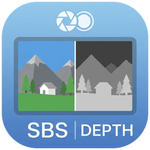

<p align="center"></p>

# Shift3D-AMD

**Owl3D Shift 무안경 3D 모니터에서, Owl3D의 2D→3D가 안 되는 그래픽카드(AMD 등)로도 아무 창을 2D→3D로 보는 프로그램.**
실행 파일 하나 (`Shift3D-AMD.exe`). [Releases](../../releases)에서 받는다.

> 비공식 개인 프로젝트다. Owl3D와 관계없다. Owl3D 파일은 들어 있지 않다.

## 기능 한눈에

- **아무 창이나 2D → 3D** — 창을 캡처해 깊이 모델(Depth Anything V3 Small, DirectML — 어떤 GPU든)로 좌우(SBS) 영상을 만든다.
- **이미 SBS인 화면은 그대로** — SBS 영상·TriDef·SBS를 직접 내는 게임은 AI 없이 통과. 브라우저·영상 플레이어는 전체 화면일 때만 3D.
- **3D 화면 위에서 마우스·키보드 그대로** — 창 모드 게임을 확대해 보일 때도 클릭이 정확히 맞는다. 낮은 사양은 창 모드 권장.
- **Owl3D 엮기 해상도** 1440p / 1080p 선택 (Owl3D 숨은 설정 자동 적용, 자동 화질 낮춤 끔).
- **깊이 계산 프로필** 부드럽게 / 정밀하게 — PC의 GPU에 맞춰 자동 선택.
- 화면을 거의 채우는 창은 1:1, 작은 창은 비율을 지켜 확대. 최소화된 게임 창은 자동으로 되살린다.
- 밝기·감마는 3D 출력에만 적용되고 기억된다. 한/영 UI, 트레이 아이콘, 콘솔 창 없음.

영문 요약과 단축키: [docs/FEATURES.md](docs/FEATURES.md)

## 어떻게 동작하나

- Owl3D 앱의 2D→3D(Live 3D)는 NVIDIA 전용이라 AMD에서는 켜지지 않는다. 하지만 **Stereo 3D Playback**(이미 좌우(SBS)인 영상을 눈 추적에 맞춰 엮는 기능)은 AMD에서도 된다.
- Shift3D가 고른 창을 캡처해 AI 깊이 모델(Depth Anything V3 Small, DirectML)로 좌우(SBS) 영상을 만들고, Owl3D가 그것을 Shift에 엮는다.
- 깊이 계산은 DirectML이라 AMD·Intel·NVIDIA 어느 그래픽카드에서도 돈다.

## 필요한 것

- Windows 10/11 64비트, DirectX 12 그래픽카드
- Owl3D Shift 모니터 + **Owl3D 앱 2.3.2 이상**

## 쓰는 법

1. Owl3D 앱 → **Stereo 3D Playback** → Stereo format **Side-by-side** → **Start**
2. `Shift3D-AMD.exe` 더블클릭 → 볼 창(YouTube, 영상 플레이어 등) 고르기 → **시작**
   - 고른 창은 **크기 그대로** 둔다. Shift3D 창이 전체 화면으로 떠서 Owl3D가 그것을 3D로 엮는다
     (AMD에서 Owl3D는 맨 앞의 전체 화면 창만 엮는다).
   - 3D 화면 위에서도 **마우스(휠·호버·클릭)와 키보드가 그 창에 그대로** 들어간다 — YouTube 플레이어 UI도 쓸 수 있다.
     작은 창(창 모드 게임 등)을 확대해 보일 때도 마우스가 맞는다 (아래 "화면 크기와 비율").
3. 끄기: `Ctrl+Alt+Q` 또는 작업 표시줄 트레이의 Shift3D 아이콘 → 종료

- 검은 콘솔 창 없이 선택 화면과 트레이 아이콘만 뜬다. 오류로 멈추면 알림창으로 알려 준다.
- 화면 글은 Windows 표시 언어에 따라 한국어 / 영어 (`--lang ko|en` 으로 바꿀 수 있다).

### 브라우저(크롬·엣지)는 옵션 하나가 필요하다

브라우저는 다른 창에 완전히 가려지면 그리기를 멈춘다. 그러면 3D 화면이 멈춘 그림이 된다.
가려져도 계속 그리도록 브라우저를 아래 옵션으로 실행한다:

```
--disable-features=CalculateNativeWinOcclusion
```

- 바로가기(작업 표시줄·바탕 화면) 오른쪽 클릭 → 속성 → **대상** 끝에 한 칸 띄우고 붙인다.
  예: `"C:\Program Files\Google\Chrome\Application\chrome.exe" --disable-features=CalculateNativeWinOcclusion`
- 브라우저를 완전히 닫았다가(트레이 포함) 그 바로가기로 다시 열어야 적용된다.

### 그 밖에
- 처음 실행할 때 안에 든 파일(약 140MB)을 `%LOCALAPPDATA%\Shift3D\` 에 풀어 둔다. 설정과 기록(`shift3d.log`)도 거기 있다. 지우려면 exe와 그 폴더를 지우면 된다.
- 서명되지 않은 exe라 처음에 Windows SmartScreen 경고가 뜰 수 있다 (추가 정보 → 실행).
- '항상 위'에 떠 있는 다른 창(일부 채팅·AI 앱 등)이 있으면 Owl3D가 3D를 켜지 않는다. 최소화할 것.

## 이미 좌우(SBS)인 화면

선택 화면에서 **"이미 좌우(SBS) 3D인 화면"** 을 체크하면 AI 변환 없이 좌우를 그대로 Owl3D에 넘긴다 (SBS 영상, TriDef 같은 SBS 출력).
이때 2번 "깊이 계산"은 쓰이지 않으므로 회색으로 꺼진다. 낮은 사양 PC에서는 게임을 **창 모드**로 두는 것을 권한다 —
작은 창을 Shift3D가 확대해 보여 주므로 게임은 가볍게 돌고, 마우스도 맞는다.

- **브라우저와 영상 플레이어는 그 창이 화면 전체를 덮을 때만 3D로 바뀐다** — 크롬이면 YouTube 전체 화면이나 F11, 플레이어면 전체 화면.
  그 전(창 상태, 최대화 포함)에는 Shift3D 화면을 숨겨 평소 화면 그대로 둔다. 페이지·파일을 고르고 조작하기 쉽게.
  전체 화면을 빠져나오면 다시 평소 화면이 된다 (1초 안의 깜빡임은 무시).
- 게임처럼 SBS를 직접 내는 프로그램은 바로 3D로 바뀐다. 게임 창이 최소화돼 있으면 되살려서 캡처하고, 3D 중에 최소화되면 (포커스를 뺏지 않고) 다시 올린다.

- 보통 SBS(half-SBS: 16:9 한 장에 두 눈을 가로로 눌러 넣은 것) — 한쪽 눈을 다시 늘려 원래 16:9로 보여 준다.
- 아주 넓은 창(3:1 이상, 예: 32:9 full-SBS) — 반쪽이 그 자체로 한 화면이므로 늘리지 않는다.

## 화면 크기와 비율

- 창이 화면을 거의 채우면(가로나 세로 90% 이상) 확대하지 않고 **창 자리 그대로 1:1** 로 그린다. 마우스가 정확히 맞는다.
- 그보다 작은 창(창 모드 게임, 낮은 해상도로 띄운 게임 등)은 **원래 비율(16:9 등)을 지킨 채** 화면에 맞춰 키운다. 남는 곳은 검게 둔다.
  - 브라우저·영상 플레이어: 마우스를 좌표 환산해 넘긴다.
  - 게임: 게임은 실제 커서 위치를 읽으므로, 실제 커서를 **게임 창 안에** 두고 손의 움직임을 창 크기 비율로 옮긴다. 화면에는 Shift3D가 화살표를 대신 그린다. 그래서 확대해 보여도 클릭 위치가 게임과 정확히 맞는다.
- 캡처는 창이 실제로 그린 해상도 그대로다. 가장 선명하게 보려면 게임 해상도를 모니터 출력 해상도에 맞춘다.

## Owl3D 엮기 해상도 (선택 화면 4번)

Owl3D는 기본으로 1440p로 줄여 엮고, 부하가 크면 더 낮춘다(자동 화질 낮춤). Shift3D가 3D가 켜진 뒤 Owl3D의 숨은 설정을 자동으로 맞춘다 (잠깐 설정 창이 스칠 수 있다):

- **1440p** — 더 선명. **1080p** — 더 빠르고 조금 부드럽다(낮은 사양 권장). 마지막 선택을 기억한다.
- 자동 화질 낮춤은 끈다 — 고른 해상도가 그대로 유지된다.
- 명령줄 `--owl-res native|1440|1080|720` 으로 원본(4K)·720p 까지 정할 수 있다 (선택 화면보다 우선).

## 밝기·감마 (선택 화면에서 고름)

- **기본** — 밝기 1.00, 감마 1.00 으로 시작
- **저장한 값** — 3D 중에 마지막으로 바꾼 값으로 시작 (`Ctrl+Alt+Home/End`, `PageUp/PageDown` 으로 바꾸면 저장된다)

3D 출력에만 적용되므로 3D를 끄면 화면은 원래 밝기다.

## 깊이 계산 (선택 화면에서 고름)

| 선택 | 그래픽카드 | 특징 |
|---|---|---|
| 부드럽게 (기본) | 화면을 맡지 않은 카드, 내장 그래픽 우선 · 해상도 238 (그래픽카드가 하나뿐이면 154) | 화면이 끊기지 않는다 |
| 정밀하게 | 가장 강한 카드 · 해상도 266 (화면을 맡은 카드면 196) | 화면 카드를 Owl3D와 같이 쓰면 깊이 계산이 쉬어 가며 돌아서 가끔 끊길 수 있다 |

실측 (Ryzen 7 7840HS: Radeon 780M + RX 7600M XT, v0.3.5): 부드럽게 = 780M·238, 깊이 약 22fps·출력 60fps / 정밀하게 = 7600M XT·196, 깊이 약 15fps·출력 55fps. 이 PC에서는 '부드럽게'가 모든 면에서 낫다.

## 단축키 (모두 Ctrl + Alt 와 함께)

| 키 | 하는 일 |
|---|---|
| ↑ / ↓ | 시차(입체 강도) 강하게 / 약하게 |
| ← / → | 깊이 — 화면 뒤로 / 앞으로 |
| Home / End | 밝기 올리기 / 내리기 (엮으면 어두워 보일 때). 3D 출력에만 적용, 바꾼 값은 기억 |
| PageUp / PageDown | 감마 올리기 / 내리기 (중간톤 밝기). 3D 출력에만 적용, 바꾼 값은 기억 |
| Q | 종료 |
| H | 3D 켜기 / 끄기 |
| M | 모드 (AI 변환 → 이미 SBS인 화면 → 2D 그대로 → 좌우 색 시험) |
| S | 좌우 눈 바꾸기 |
| E | 깊이 보정 방식 바꾸기 |
| C | 3초 연속 캡처 (`%LOCALAPPDATA%\Shift3D\shots`) |

## 명령줄

`Shift3D-AMD.exe --help` 에 전부 있다. 자주 쓰는 것:

| 옵션 | 하는 일 |
|---|---|
| `--process <exe>` / `--title <제목 일부>` | 선택 화면 없이 바로 그 창으로 시작 |
| `--mode sbs` | 이미 좌우(SBS)인 화면으로 (선택 화면의 체크와 같음) |
| `--owl-res native\|1440\|1080\|720` | Owl3D 엮기 해상도 |
| `--owl-quality` | Owl3D 엮기를 원본 해상도로, 자동 화질 낮춤 끄기 |
| `--borderless` | 게임 창을 테두리 없는 전체 화면으로 (끝내면 원래대로). 게임이 4K로 돌아 느려질 수 있다 |
| `--lang ko\|en` | 화면 글 언어 |

---

## English (short)

Watch any window in glasses-free 3D on an **Owl3D Shift** with a GPU where Owl3D's own 2D→3D does not run (e.g. AMD).
Shift3D turns the window into side-by-side 3D with a small depth model (Depth Anything V3 Small on DirectML, any vendor);
Owl3D's **Stereo 3D Playback** (Side-by-side) does the eye tracking and weaving. Unofficial, not affiliated with Owl3D;
no Owl3D files are included.

1. Owl3D app → Stereo 3D Playback → Side-by-side → Start
2. Run `Shift3D-AMD.exe`, pick the window, press 시작 (Start). The window keeps its size; Shift3D shows a fullscreen window that Owl3D weaves,
   and passes the mouse on (the keyboard stays with the window). Browsers: start them with `--disable-features=CalculateNativeWinOcclusion`, or they stop drawing while covered.
3. Already side-by-side content (SBS video, TriDef): tick "이미 좌우(SBS)" (already SBS) — no AI, the halves go straight to Owl3D; the depth section is greyed out.
   For browsers and video players 3D starts only while that window covers the whole screen (YouTube fullscreen, F11, a player's fullscreen); until then Shift3D stays hidden so the page is easy to use. Games that output SBS themselves go 3D at once; a minimized game window is restored.
   Half-SBS is stretched back to 16:9; windows 3:1 or wider are treated as full-SBS. A window that nearly fills the screen is drawn 1:1 in place
   (exact mouse); a smaller one is scaled up keeping its aspect ratio. For a windowed game shown enlarged, the real cursor is kept inside the game
   window and moved in proportion, with an arrow drawn on the 3D picture, so clicks land where you see them — windowed mode is recommended on slow PCs.
4. Section 4 picks Owl3D's weave resolution, 1440p or 1080p (faster); Shift3D sets Owl3D's hidden setting after 3D starts and turns its auto quality drop off. `--owl-res native|1440|1080|720` on the command line.
5. Quit with `Ctrl+Alt+Q` or the Shift3D tray icon. No console window; errors show in a message box. The UI follows the Windows display language (Korean or English, `--lang en` to force English). Parallax `Ctrl+Alt+↑/↓`, depth `Ctrl+Alt+←/→`, brightness `Ctrl+Alt+Home/End`, gamma `Ctrl+Alt+PageUp/PageDown`.

## 라이선스 / Third-party

이 실행 파일에 들어 있는 것 (`licenses/`):

| 구성 요소 | 라이선스 |
|---|---|
| ONNX Runtime (DirectML) 1.24 | MIT — `licenses/onnxruntime-LICENSE.txt` |
| DirectML 1.15 | Microsoft 재배포 라이선스 — `licenses/DirectML-LICENSE.txt` |
| Depth Anything V3 Small (onnx-community) | Apache-2.0 — `licenses/Apache-2.0.txt` |
| Microsoft Visual C++ 런타임 | Visual Studio 재배포 조건 |

Owl3D, Owl3D Shift는 해당 권리자의 상표다.
